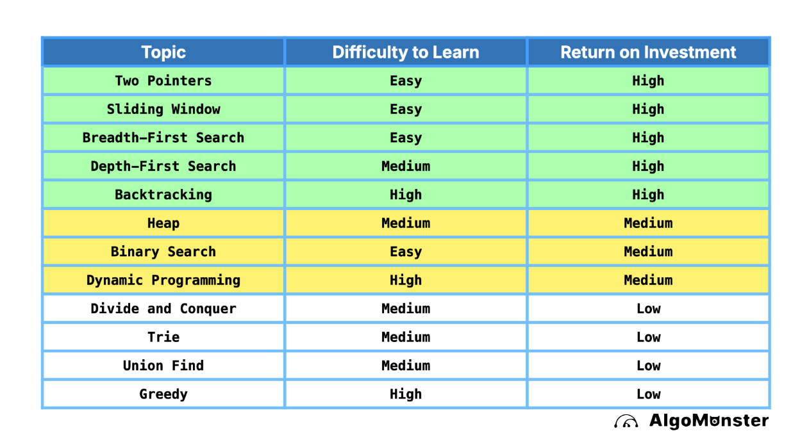

# Meet and LeetCode Practice Repository

This repository contains solutions and practice materials for coding interview preparation.

## Must Know Concepts
* Big O notation and complexity analysis (CCI pg 26-54)
* Data structures: arrays, linked lists, stacks, queues, trees, graphs, hash tables
* Algorithms: sorting, searching, dynamic programming, recursion
* System design fundamentals

## Resources
* Cracking the Coding Interview (CCI) - Located in `material` folder
* LeetCode problem solutions organized by date in `solved_problem` folder

## Study Strategy
Focus on these areas to maximize your return on investment:

## For serious study
Sign up algomonster here with discount:

https://algo.monster/referral?ref=250d64553fd306b82dc8521dd62a26838894e48346a14632905fb9418ec5e210

## Important Notes
When working with Python type hints, use lowercase `list` instead of uppercase `List` for better compatibility with modern Python versions (3.9+).

